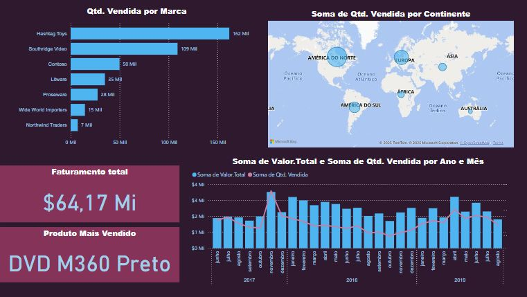
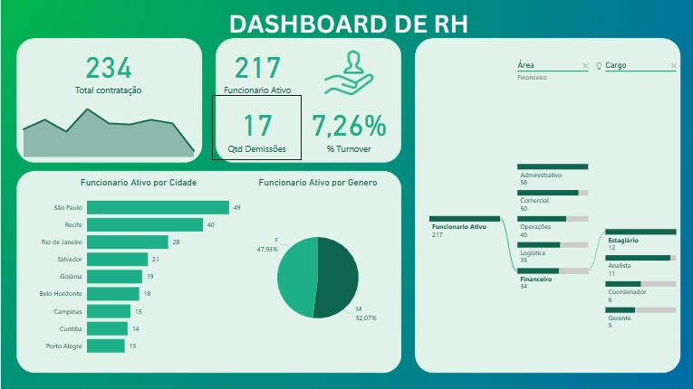
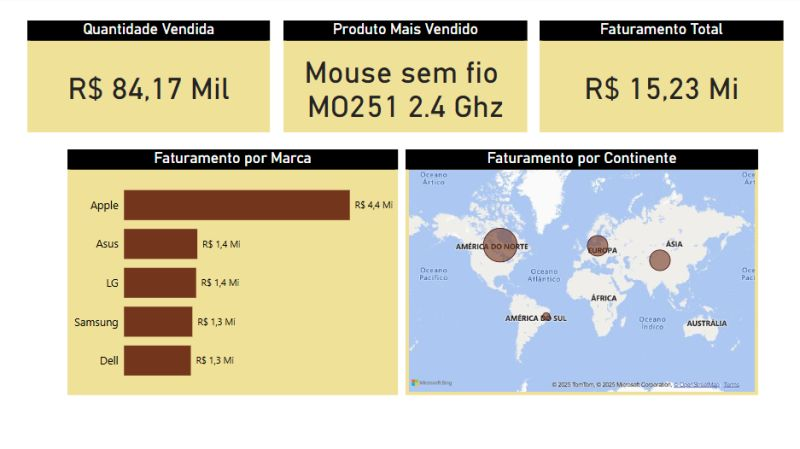
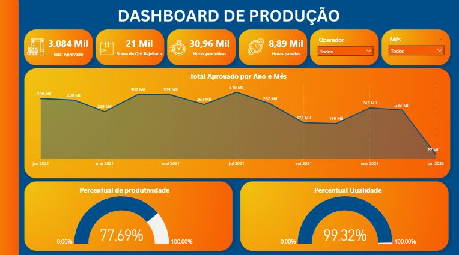

# Portfólio de Dashboards em Power BI

Este portfólio reúne alguns dos dashboards desenvolvidos no Power BI com foco em diferentes áreas de negócio, como Vendas, RH, Produção e Financeiro. Cada visualização foi criada com o objetivo de facilitar a tomada de decisão por meio de dados claros, objetivos e visualmente organizados.

---

## Dashboard Financeiro

**Objetivo:** Analisar o fluxo financeiro da empresa, com destaque para recebimentos, pagamentos, impostos e lucro.

**Destaques:**
- Receita total: **R$ 94,60 Mi**
- Lucro: **R$ 35,55 Mi** com **margem de 37,58%**
- Comparativo mensal de lucro com variações positivas e negativas
- Percentual de transações via Pix: **44,04%**

---

## Dashboard de Vendas Global

**Objetivo:** Avaliar a performance de vendas por marca, produto, continente e período.

**Destaques:**
- Faturamento total: **$64,17 Mi**
- Produto mais vendido: **DVD M360 Preto**
- Maior marca em volume: **Hashtag Toys (162 mil unidades)**
- Visualização geográfica das vendas por continente

---

## Dashboard de RH

**Objetivo:** Monitorar os principais indicadores de Recursos Humanos.

**Destaques:**
- Total de contratações: **234**
- Funcionários ativos: **217**
- Turnover: **7,26%**
- Segmentação por cidade, gênero e área/cargo

---

## Dashboard de Vendas por Produto

**Objetivo:** Acompanhar as vendas por produto, marca e continente.

**Destaques:**
- Produto mais vendido: **Mouse sem fio M0251 2.4 Ghz**
- Faturamento total: **R$ 15,23 Mi**
- Apple lidera com R$ 4,4 Mi em faturamento
- Visualização de performance por continente

---

## Dashboard de Produção

**Objetivo:** Medir a produtividade e qualidade da produção ao longo dos meses.

**Destaques:**
- Total aprovado: **3.084 Mil**
- Produtividade: **77,69%**
- Qualidade: **99,32%**
- Análise mensal das horas produtivas e paradas

---

*Todos os dashboards foram desenvolvidos no Power BI com foco em clareza visual, usabilidade e entrega de insights estratégicos para o negócio.*

